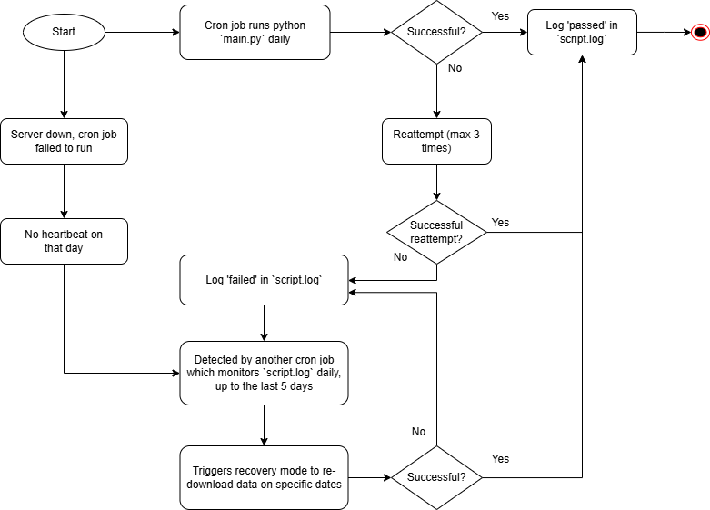

# DTL Data Team Mini-Project

- **Author**: Chau Jia Yi  
- **Deadline**: 31/12/2024  

## Project Overview

This project automates the daily download of derivative data from the Singapore Exchange (SGX) website. The script uses Selenium to interact with the website and provides flexible command-line arguments for various modes of operation, including downloading today's files, historical files, or files based on a user-defined date range. A recovery mode reattempts failed downloads. The project integrates a cron job for scheduling and logging for monitoring and debugging.

---

## Getting Started

### Prerequisites

Ensure the following are installed on your system:
1. **Python 3.10+**
   - Install via your package manager, e.g., `sudo apt install python3`.
2. **pip**
   - Usually included with Python. Verify using `pip --version`.
3. **Google Chrome**
   - Install Chrome on your system. Ensure it matches the version of ChromeDriver used.
4. **ChromeDriver**
   - Automatically managed via `webdriver-manager` in the script.
5. **Bash and Cron** (Linux/WSL only)
   - Cron should be running: `sudo service cron start`.

---

### Installation

1. **Unzip the Source Code.** 
    ```bash
    unzip source_code.zip -d project_directory
    ```

2. **Create a Virtual Environment**  
   ```bash
   python3 -m venv venv
   source venv/bin/activate
   ```

3. **Install Required Packages**  
   ```bash
   pip install -r requirements.txt
   ```

---

## Usage

### Running the Script Manually
```bash
python source/main.py --mode <mode>
```

**Options for `--mode`:**
- `listed`: Download all files available for each day as listed on the SGX website.
- `today`: Download only today's files.
- `custom`: Download a specific file from the history.

**In `custom` mode:, specify `--date`**
- `--date`: Specify a date in YYYY-MM-DD format.

Example:
```bash
python source/main.py --mode listed
python source/main.py --mode today
python source/main.py --mode custom --date 2024-12-31
```

### Logging Options
You can enable debug-level logging using the `--debug` command line argument. This provides detailed logs for debugging purposes.

Example:
```bash
python source/main.py --mode listed --debug
```

**Logging Details:**
- **Default Behavior**: Logs `INFO` level and above messages to the console and to `logs/script.log`.
- **Debug Mode (`--debug`)**: Logs all `DEBUG` level messages in addition to the default behavior.
- **Selenium Logs**: Logged separately in `logs/selenium.log` for better segregation of application and Selenium logs.

### Log Files
- **`logs/script.log`**: Contains application logs, including `DEBUG` (when `--debug` is used), `INFO`, `WARNING`, `ERROR`, and `CRITICAL` messages.
- **`logs/selenium.log`**: Dedicated log file for Selenium-specific debugging information, such as HTTP requests and responses.

Example to check logs:
```bash
tail -f logs/script.log
```

---

### Setting up the Cron Job
In `setup_cron.sh`, make sure to change these paths according to your local system: `PROJECT_PATH`, `SCRIPT_PATH`, and `VENV_PATH`.

Run the `setup_cron.sh` script to schedule the script.
```bash
./scheduler/setup_cron.sh
```

Verify the cron job:
```bash
crontab -l
```

---

## Recovery Plans/Key Concerns



### Failed Downloads
- **Automatic Reattempts**: Automatically reattempts failed downloads 3 times with delays between attempts.
- **Tracking Status**: A cron job will run `monitoring.py` daily to check historical download statuses and detect failed downloads in `script.log`.
- **Recovery Mode**: The `--mode recovery` option will run automatically if failed attempts are detected within the last 5 days. It can also be run manually to recover data on specific dates when needed.

### Server/Machine Downtime
- **Automatic Cron Restart**: Configure the cron service to restart automatically after a reboot: `sudo systemctl enable cron`
- **Heartbeat check**: `monitoring.py` will also check for missing heartbeat logs (`SCRIPT EXECUTION STARTED`) on certain days. If no heartbeat is detected, it will assume a failure and trigger recovery.

### Storage/Logging Overload
- **Automated Cleanup**: Set up a cron job to delete/archive files older than a specified number of days.
- **Log Rotation**: Use Python's `RotatingFileHandler` to limit log file size and maintain a fixed number of backup files.

### Historical Files
- Since the cron job runs daily to download data and robust recovery plans are in place, all files are organized in separate directories named by `dates` in local file system. Therefore, it is possible to retrieve historical data from local storage even if it is no longer available on the SGX website.

### Website Changes
- **Handling Updates**: If SGX updates the website layout, the script may require updates to XPaths or interaction logic.
- **Error Identification**: Logging will help identify errors caused by such changes.

---

## Additional Notes

- Ensure that the `downloads/` directory has appropriate permissions for saving files.
- Run the script manually at least once to verify your environment setup before scheduling it via cron.

---

## Acknowledgments

This project is part of the DTL Data Team Mini-Project. Special thanks to DTL for providing me with the opportunity.
